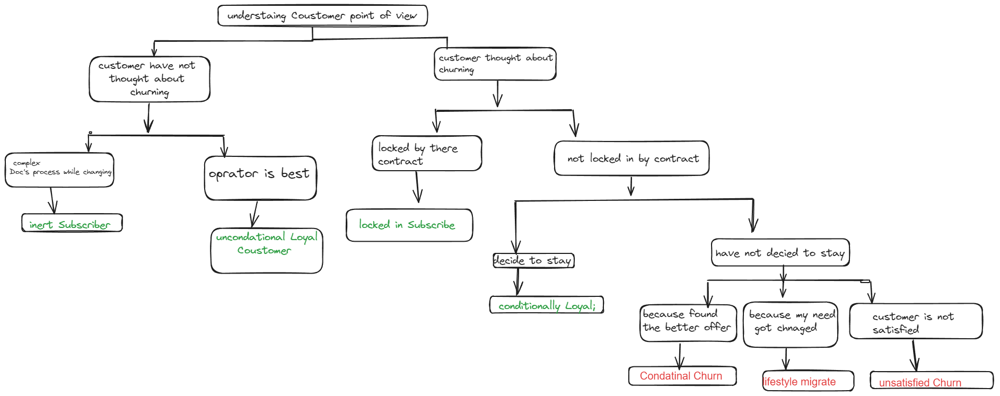
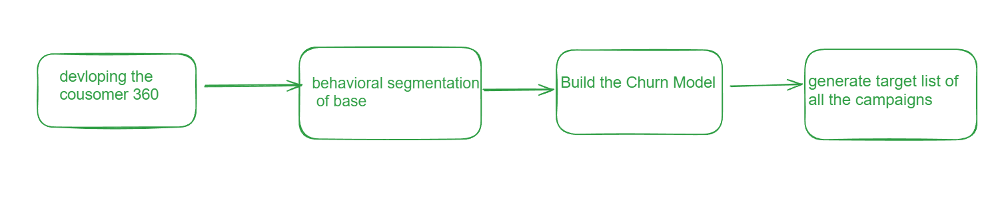
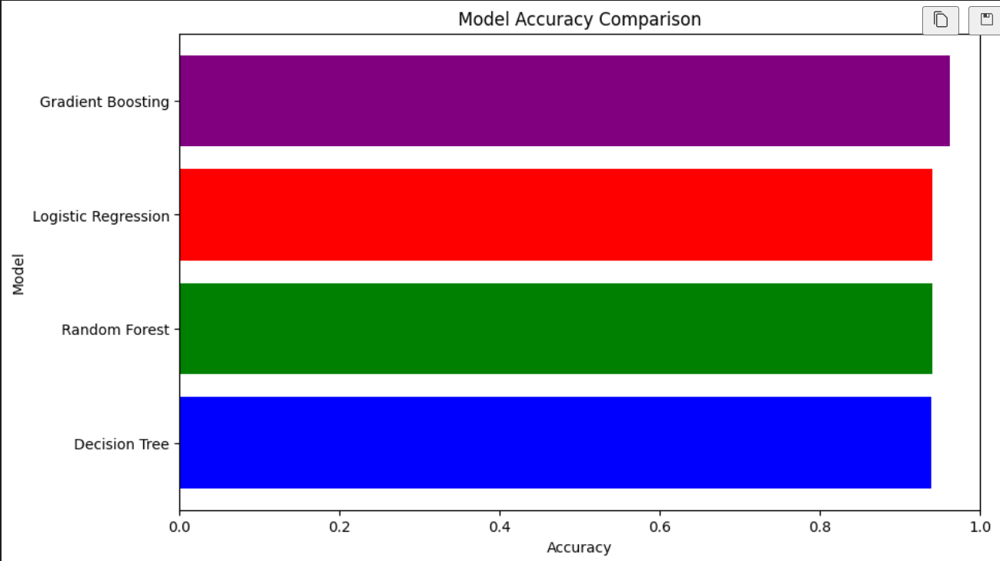

# Predicting Customer Churn in a Telecommunications Company

## Inroduction

## Problem we need to solve 

### Let's  understand  the term churn 
In the highly competitive telecommunication industry, customer churn prediction has emerged as a critical strategy for maintaining a loyal customer base and ensuring long-term profitability. Customer churn refers to the phenomenon where subscribers discontinue their services with a telecom provider, either by switching to a competitor or ceasing to use the service altogether. Given the significant costs associated with acquiring new customers compared to retaining existing ones, accurately predicting and mitigating customer churn is essential for telecom companies.

### Understant the type of churn happend in telecommunication industry
- **traiff plan churn** - customer down grader there subscription Model 
- **services churn** - customer leave after the weekly/ monthly plan is completed 
- **Product Churn** -  customer chnage there mode to post paid to perpaid
- **Usage Churn** - Coustomer Inacive there telecommunication services

## What is Cause behind the churn with respect to the customer's point of view 

### Objective: 
- The primary objective of this project is to develop a predictive model that can identify 
  customers at risk of churning, enabling the company to take proactive measures to retain them.

### Solution 

1. **devloping the cousomer 360**
A "Customer 360" view is a comprehensive aggregation of all relevant customer data from various touchpoints into a single, unified profile.
2. **behavioral segmentation of base**
the process of sorting and grouping customers based on the behaviors they exhibit.
3. **Build the Churn Model**
Predict the Model using differn ML Algorithm
4. **generate target list of all the campaigns**
Using machine learning, generate a target list by identifying customers most likely to respond positively to specific marketing campaigns based on comprehensive data analysis.

### Model USed In Data Sets 
- Decision Tree classifier
- Random Forest Classifier
- Logistic Regression
- GradientBoostingClassifier

### Comparisation OF ALL the  Model 

### Conclusion 

In our customer churn prediction project, we evaluated multiple machine learning models, including Decision Tree, Random Forest, and Gradient Boosting classifiers, to identify at-risk customers. After thorough data analysis and cleaning, we found that the Decision Tree achieved 79% accuracy, performing well for non-churn predictions but less effectively for churn predictions. The Random Forest model showed better balance with a 92% accuracy, achieving around 90% precision and recall for churn predictions and 94% for non-churn. The Gradient Boosting classifier outperformed both, with a 96% accuracy and balanced precision and recall of 96% for non-churn and 97% for churn. This high performance makes Gradient Boosting the most effective model for predicting customer churn, enabling proactive customer retention strategies.

## How to Run on Your local 

